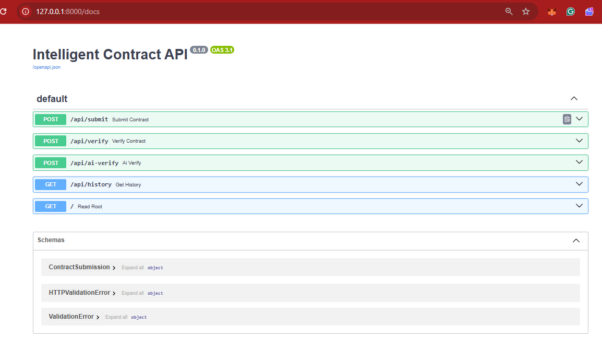
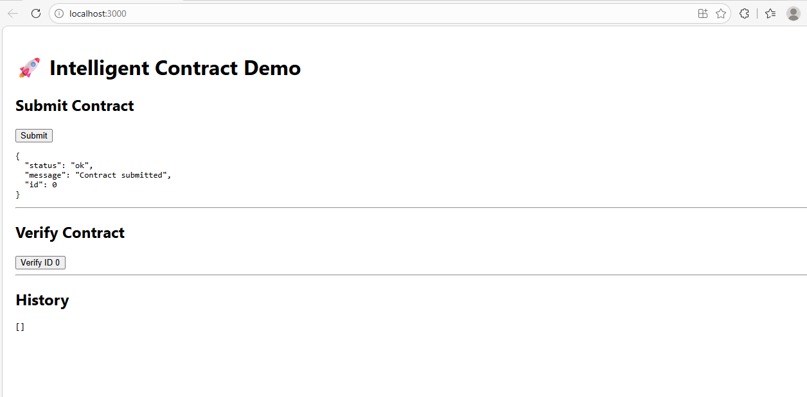
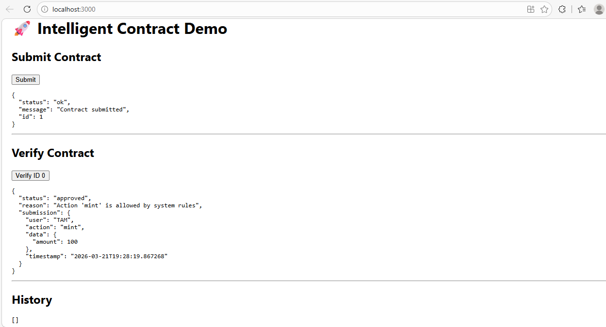
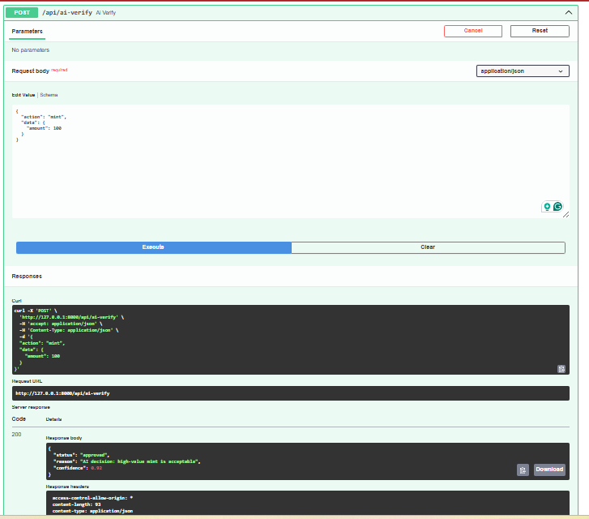
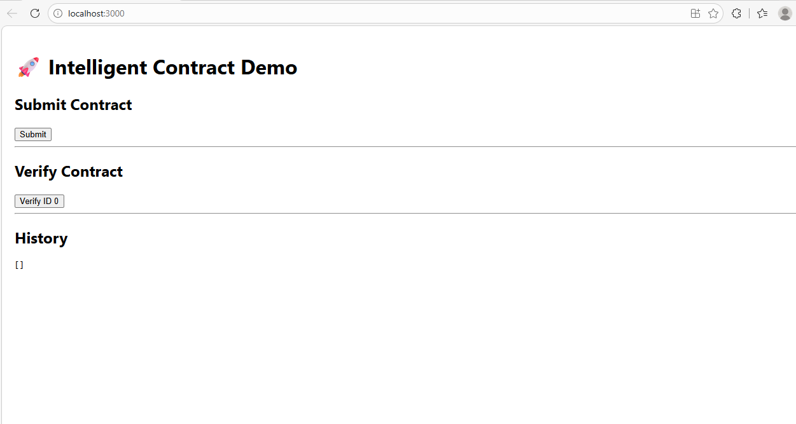

# 🚀 Intelligent Contract API (From Zero to GenLayer)

## 🌐 Live Demo

https://intelligent-contract-api.vercel.app/docs

> A GenLayer-style Intelligent Contract system with FastAPI + React


---

# 📌 Overview

This project implements a **GenLayer-inspired Intelligent Contract system**, demonstrating how smart contracts can be enhanced with off-chain logic and AI-like reasoning and explainable decision making.

Users can:

* 📥 Submit contract requests
* 🔍 Verify contract execution
* 📜 Track contract history

---

# 🧠 Concept

## 🔥 What is GenLayer?

GenLayer introduces **Intelligent Contracts** — an evolution of traditional smart contracts that can:

* Perform off-chain reasoning
* Handle flexible and dynamic logic
* Simulate AI-like reasoning and explainable decision-making processes

---

## 💡 Project Idea

This project simulates an Intelligent Contract workflow:

1. User submits a contract
2. System stores contract data
3. User triggers verification
4. System evaluates logic
5. Returns decision + reasoning

---

# ⚙️ API Endpoints

## 📥 Submit Contract

```
POST /api/submit
```

### Request

```json
{
  "user": "Alice",
  "action": "mint",
  "data": {
    "amount": 100
  }
}
```

---

## 🔍 Verify Contract

```
POST /api/verify?submission_id=0
```

### Example Response

```json
{
  "status": "approved",
  "reason": "Action 'mint' is allowed by system rules",
  "submission": {
    "user": "Alice",
    "action": "mint",
    "data": {
      "amount": 100
    },
    "timestamp": "2026-01-01T00:00:00"
  }
}
```

### Logic

* Supported actions: `mint`, `transfer`
* Unsupported actions → rejected

---

## 📜 History

```
GET /api/history
```

---

## 🤖 AI Verify (Simulated Intelligence)

```
POST /api/ai-verify
```

### Description

This endpoint simulates AI-based contract evaluation with reasoning and confidence score, similar to GenLayer's intelligent execution model.

### Example Response

```json
{
  "status": "approved",
  "reason": "AI decision: high-value mint is acceptable",
  "confidence": 0.92
}
```

# 🔄 Flow Diagram

```
        User
         │
         ▼
   POST /submit
         │
         ▼
   Store contract
         │
         ▼
   POST /verify
         │
   ┌─────┴─────┐
   ▼           ▼
 Approved   Rejected
   │           │
   └─────┬─────┘
         ▼
     Response
```

---

# 🏗️ Project Structure

```
intelligent-contract-api/
│
├── main.py
├── api/
│   └── routes.py
├── contracts/
├── genlayer-frontend/
└── README.md
```

---

# 💻 Tech Stack

* ⚡ FastAPI (Backend)
* ⚛️ React (Frontend)
* 🔗 REST API architecture

---

# 📸 Screenshots

> ⚠️ These screenshots demonstrate the full workflow of the Intelligent Contract system

---

## 🧪 Swagger API



---

## 📥 Submit Contract



---

## 🔍 Verify Contract



---

## 🤖 AI Verify (GenLayer-style)



---

## 🌐 Frontend Demo



---

# 🚀 Deployment

## Backend (Vercel)

```json
{
  "builds": [
    { "src": "main.py", "use": "@vercel/python" }
  ],
  "routes": [
    { "src": "/(.*)", "dest": "main.py" }
  ]
}
```

---

# 🏆 Why This Project Matters

This project demonstrates:

* Off-chain contract reasoning
* API-driven contract execution
* Modular contract evaluation

These are key ideas behind GenLayer's architecture.

---

# 🔥 Future Improvements

* 🤖 AI-based reasoning (LLM integration)
* 📜 Explainable decision logs
* 🔗 Blockchain interaction simulation
* 📊 UI dashboard

---

# 🎯 Submission Description

This project demonstrates a GenLayer-style Intelligent Contract system built with FastAPI and React. It allows users to submit, verify, and track contracts while simulating off-chain reasoning and flexible execution logic.

---

# 📬 Author

Built for GenLayer Mission 🚀
